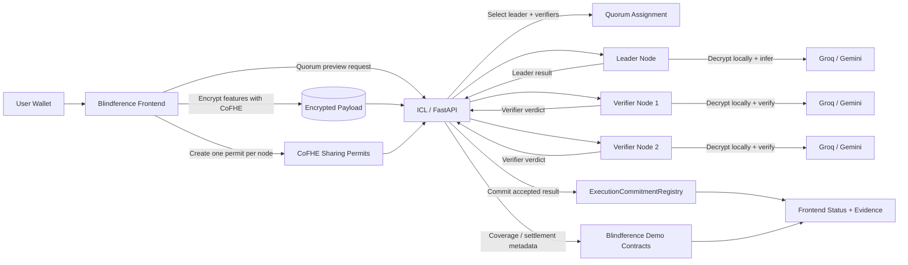
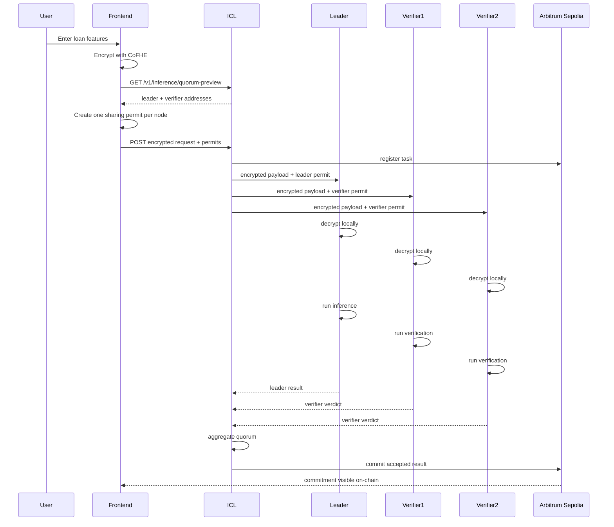
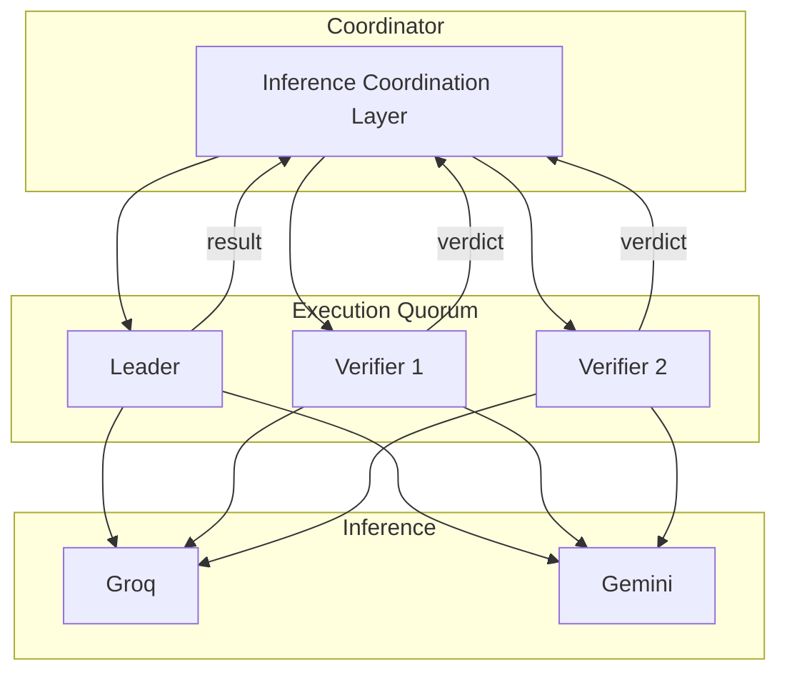
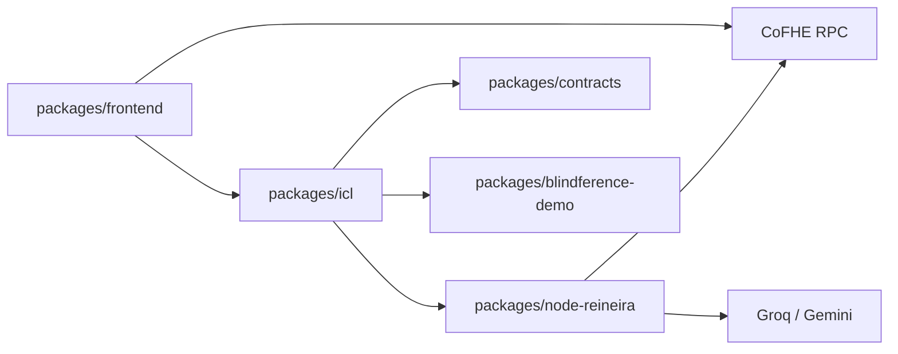
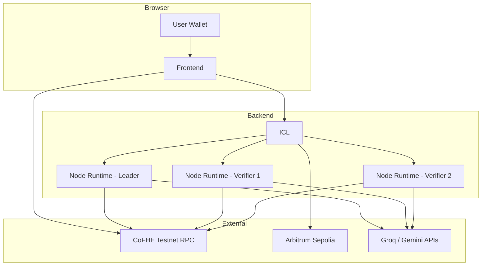

# Architecture

## Overview

Blindference Wave 2 is a confidential AI execution pipeline with economic verification and on-chain settlement visibility.

In the current demo:

1. The frontend encrypts loan-risk features with CoFHE in the user's wallet.
2. The ICL previews and assigns a quorum of `1 leader + 2 verifiers`.
3. The frontend creates one CoFHE sharing permit per selected node and submits the encrypted payload.
4. Each node decrypts locally, runs inference through Groq or Gemini, and submits a result or verifier verdict.
5. The ICL aggregates the quorum, commits the final result hash to `ExecutionCommitmentRegistry`, and records demo settlement metadata.
6. The frontend renders the full lifecycle: assignment, execution, verification, commitment, coverage, and mock escrow release.

## System Diagram



## Request Sequence



## Quorum Topology



## Main Components

### Frontend

Location: `wave2_network/packages/frontend`

- React/Vite application used as the buildathon demo UI
- Wallet connection via `wagmi`
- Real CoFHE browser client via `@cofhe/sdk`
- Quorum preview before submission
- Multi-recipient permit creation for leader and verifiers
- Live request polling and visual quorum progress
- Coverage, dispute, and settlement evidence display

### ICL

Location: `wave2_network/packages/icl`

- FastAPI coordination backend
- Quorum preview and task creation
- Permit-aware request intake
- Task registration on Arbitrum Sepolia
- Leader result and verifier verdict ingestion
- Quorum aggregation and final commitment
- Demo metadata for coverage and visible escrow release

### Node Runtime

Location: `wave2_network/packages/node-reineira`

- One process per operator key
- Role detection: leader or verifier
- CoFHE decrypt path using user-shared permits
- Hosted inference via Groq or Gemini
- Result hashing and callback submission to the ICL

### Contracts

Locations:

- `wave2_network/packages/contracts`
- `wave2_network/packages/blindference-demo`

Core protocol:

- `NodeAttestationRegistry`
- `ExecutionCommitmentRegistry`
- `AgentConfigRegistry`
- `ReputationRegistry`
- `RewardAccumulator`

Demo vertical:

- `BlindferenceAgent`
- `BlindferenceAttestor`
- `BlindferenceUnderwriter`
- `MockPriceOracle`

## Package Boundary Diagram



## Privacy Model

- The ICL never receives plaintext loan features.
- Ciphertexts are created in the browser.
- The user shares CoFHE permits only with the selected quorum members.
- Each node decrypts locally with its own wallet-scoped permit.
- Verifiers work from the same encrypted payload, not from a plaintext copy from the coordinator.

## Demo Settlement Model

The buildathon demo uses:

- real on-chain execution commitment on Arbitrum Sepolia
- real quorum selection and result aggregation
- real coverage and dispute surfaces in the UI
- a mock escrow release evidence step after accepted scoring so the demo shows the full economic lifecycle without requiring a production escrow releaser

## Deployment View



## Package Boundaries

```text
wave2_network/
├── packages/contracts/         Core protocol
├── packages/blindference-demo/ Demo contracts
├── packages/icl/               Coordination backend
├── packages/frontend/          User-facing BF app
├── packages/node-reineira/     Quorum node runtime
├── packages/fhe-mocks/         Optional local FHE helpers
└── protocol/                   Reineira upstream reference
```

## Remaining Non-Final Pieces

- Production identity / ERC-8004 registry replacement for mocks
- Production escrow release path instead of demo settlement metadata
- Production oracle and policy hardening for disputes and underwriting
- Full operator lifecycle automation for reputation, rewards, and staking
