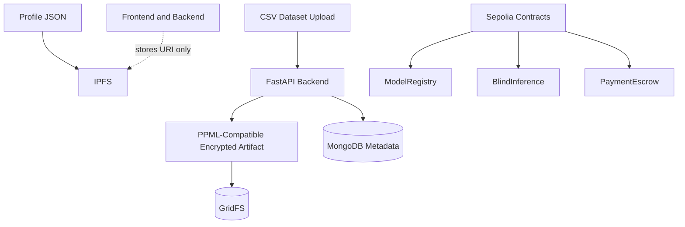

# Blindference

Blindference is the main product repository for our Wave 1 Fhenix buildathon project: a confidential AI marketplace where data owners can submit private inputs, AI labs can publish encrypted models, and inference happens without exposing plaintext data or model parameters on-chain.

It combines:

- a React frontend for role-aware user flows
- a FastAPI backend for authentication, metadata orchestration, and encrypted artifact management
- Fhenix/CoFHE smart contracts for encrypted inference and payments
- MongoDB, GridFS, and IPFS for application storage and provenance
- a PPML-compatible bridge for encrypted training artifacts

The companion repository, `PPML`, focuses on encrypted model training. `blindference` is the platform and product layer.

## Demo

- Video walkthrough: `<add-demo-video-link>`

## What Blindference Solves

Blindference is built around a simple problem: useful ML collaboration often requires sharing the two things participants most want to protect, private data and proprietary models.

Wave 1 focuses on a practical confidential AI workflow:

- `Data Source` uploads a dataset and requests inference without exposing usable plaintext to the marketplace
- `AI Lab` activates a wallet-bound lab identity, publishes encrypted model parameters, and monetizes inference
- the requester pays for inference through escrow
- the result remains encrypted on-chain and is only revealed to the requesting wallet through the Fhenix decryption flow
- profile identity, dataset provenance, and artifact tracking stay auditable without making MongoDB the protocol authority

## Wave 1 Scope

What is implemented in this repository:

- wallet-based authentication with signed nonces and JWT-backed app sessions
- two explicit product roles: `data_source` and `ai_lab`
- AI Lab activation on-chain through `ModelRegistry`
- encrypted model registration with Fhenix-compatible handles
- encrypted inference on Sepolia
- pay-per-inference flow with escrow and fee splitting
- requester-only result reveal using permits and local decryption
- IPFS-backed profile metadata
- MongoDB and GridFS-backed dataset/model artifact storage
- PPML-compatible encrypted dataset manifests and artifact tracking

## Architecture Overview

```mermaid
flowchart LR
    DS[Data Source] --> FE[Blindference Frontend]
    LAB[AI Lab] --> FE

    FE --> MM[MetaMask]
    FE --> SDK[@cofhe/sdk Client]
    FE --> IPFS[IPFS via Pinata]
    FE --> API[FastAPI Backend]

    API --> MONGO[(MongoDB)]
    API --> GFS[(GridFS)]
    API --> PPML[PPML-Compatible Encrypted Artifact Bridge]

    FE --> REG[ModelRegistry]
    FE --> BI[BlindInference]
    BI --> ESC[PaymentEscrow]
    BI --> FHE[(Encrypted euint32 State)]
```

## Roles

### Data Source

The `data_source` side is responsible for:

- uploading CSV datasets
- triggering backend encryption into PPML-compatible artifacts
- browsing available models
- submitting encrypted inference inputs
- decrypting only its own result
- tracking inference requests and outcomes

### AI Lab

The `ai_lab` side is responsible for:

- managing a wallet-bound public profile
- publishing its profile URI to IPFS
- activating lab identity on-chain
- registering encrypted model parameters on Fhenix
- browsing encrypted datasets shared through the platform
- uploading encrypted model artifacts linked to dataset provenance

## How We Use Fhenix

Blindference is not just "FHE-adjacent"; the platform is built directly around the Fhenix toolchain.

### In the frontend

We use `@cofhe/sdk` to:

- create a CoFHE client connected to Sepolia
- encrypt inference inputs in the browser with `encryptInputs(...)`
- encrypt mock model weights and bias before registration
- create and manage permits with `client.permits.getOrCreateSelfPermit()`
- reveal encrypted results locally with `decryptForView(...)`

### In the contracts

We use `@fhenixprotocol/cofhe-contracts` and `FHE.sol` to:

- convert encrypted calldata into encrypted `euint32` values with `FHE.asEuint32(...)`
- perform encrypted arithmetic with `FHE.add(...)` and `FHE.mul(...)`
- keep encrypted values usable inside contract state with `FHE.allowThis(...)`
- authorize the inference engine and requester to access ciphertext handles with `FHE.allow(...)`

### Why that matters

This gives Blindference three concrete confidentiality guarantees in Wave 1:

- user inference inputs are encrypted before they reach the contract
- model weights and bias are stored and consumed as encrypted handles
- the final result is only decrypted client-side by the authorized requester

## Core System Design

### Identity and authority

- Wallet address is the user identity
- Authentication is signature-based, not email/password based
- AI Lab authority is canonical on-chain
- Profile metadata is canonical on IPFS
- MongoDB is an application database, not the source of truth for protocol identity

### Storage model



### What is stored where

| Layer | What lives there | Why |
| --- | --- | --- |
| IPFS | public profile documents | canonical wallet-bound profile metadata |
| MongoDB | user metadata, dataset manifests, model metadata, submission tracking | product orchestration and indexing |
| GridFS | uploaded encrypted datasets and encrypted model artifacts | large binary/blob storage |
| Sepolia contracts | AI Lab activation, encrypted model handles, inference state, payments | protocol state and confidential execution |
| PPML companion repo | encrypted training, model export, compatible artifact generation | encrypted ML engine |

## Smart Contracts

Blindference's on-chain flow is split into focused contracts instead of one monolith.

| Contract | Purpose | What it manages |
| --- | --- | --- |
| `ModelRegistry` | AI Lab identity and model registry | lab activation, encrypted weights, encrypted bias, price, model metadata pointer |
| `BlindInference` | user-facing inference entrypoint | prediction requests and request events |
| `InferenceEngine` | encrypted compute engine | encrypted dot-product style scoring over `euint32` inputs and weights |
| `PaymentEscrow` | payment settlement layer | fee locking, processing state, lab payout, protocol cut, refunds |

### Contract responsibilities in practice

- `ModelRegistry` registers an AI lab through `registerLab(profileURI)` and stores encrypted model handles through `registerModel(...)`
- `BlindInference` extends `InferenceEngine` and emits the public `PredictionRequested` event used by the product flow
- `InferenceEngine` pulls encrypted weights from the registry, computes the encrypted score, and authorizes the requester to decrypt the result
- `PaymentEscrow` holds the inference fee, releases funds on success, and supports refunds if a request does not complete

## End-to-End Flow

### 1. AI Lab onboarding

1. Connect wallet and sign the Blindference authentication message.
2. Create or update profile metadata.
3. Publish profile JSON to IPFS.
4. Activate the lab on-chain through `ModelRegistry`.
5. Register encrypted model parameters for inference.

### 2. Data Source workflow

1. Connect wallet and authenticate.
2. Upload a CSV dataset.
3. Let the backend parse and package it into a PPML-compatible encrypted artifact.
4. Browse marketplace models.
5. Submit encrypted inference inputs.
6. Pay the inference fee through escrow.
7. Decrypt the result locally with a permit.

## Deployed Contracts

Current frontend configuration points to the following Sepolia deployment:

| Component | Network | Address |
| --- | --- | --- |
| `BlindInference` | Ethereum Sepolia | `0xc84bb98Bbd8EA7356b9D55Cb2ECe6e95d6C91969` |
| `InferenceEngine` | Ethereum Sepolia | `0xc84bb98Bbd8EA7356b9D55Cb2ECe6e95d6C91969` |
| `ModelRegistry` | Ethereum Sepolia | `0x16FfD836f8d1F7749044CB97A1C32F2fB28e2A24` |
| `PaymentEscrow` | Ethereum Sepolia | `0x41b6d333F2DC3f73f12E55429C6c16096364945E` |
| Payment Token | Ethereum Sepolia | `0x1c7d4b196cb0c7b01d743fbc6116a902379c7238` |

Notes:

- `BlindInference` inherits `InferenceEngine`, so both frontend entries resolve to the same deployed contract address.
- The payment token currently configured in the frontend is Sepolia USDC.

## Repository Layout

```text
blindference/
├── backend/            FastAPI backend, auth, metadata, GridFS bridge
├── frontend/           React + Vite product UI
├── fhenix_inference/   Solidity contracts, artifacts, Hardhat deploy scripts
├── SUBMISSION_FLOW.md
├── PPML_DATASET_COMPATIBILITY.md
└── README.md
```

## Languages and Stack

### Languages

- TypeScript
- Python
- Solidity
- Markdown

### Frontend

- React
- Vite
- Ethers v6
- `@cofhe/sdk`
- Tailwind CSS

### Backend

- FastAPI
- Motor
- PyJWT
- `eth-account`
- MongoDB + GridFS

### Smart contracts

- Solidity `0.8.28`
- Hardhat
- `@fhenixprotocol/cofhe-contracts`

## Environment Setup

Blindference uses separate environments for contracts, frontend, and backend.

### 1. Contracts: `fhenix_inference/.env`

Create `blindference/fhenix_inference/.env`:

```env
SEPOLIA_RPC_URL=https://eth-sepolia.g.alchemy.com/v2/YOUR_KEY
DEPLOYER_PRIVATE_KEY=0xYOUR_PRIVATE_KEY
FEE_TREASURY=0xYOUR_FEE_TREASURY
PAYMENT_TOKEN_ADDRESS=0xYOUR_SEPOLIA_TOKEN
```

### 2. Frontend: `frontend/.env.local`

Create `blindference/frontend/.env.local`:

```env
VITE_BACKEND_URL=http://127.0.0.1:8000
VITE_BLIND_INFERENCE_ADDRESS=0xYOUR_BLIND_INFERENCE_ADDRESS
VITE_INFERENCE_ENGINE_ADDRESS=0xYOUR_INFERENCE_ENGINE_ADDRESS
VITE_MODEL_REGISTRY_ADDRESS=0xYOUR_MODEL_REGISTRY_ADDRESS
VITE_PAYMENT_ESCROW_ADDRESS=0xYOUR_PAYMENT_ESCROW_ADDRESS
VITE_PAYMENT_TOKEN_ADDRESS=0xYOUR_PAYMENT_TOKEN_ADDRESS
VITE_DEFAULT_MODEL_ID=1
VITE_DEFAULT_REQUEST_ID=1
VITE_PINATA_JWT=your_pinata_jwt
VITE_IPFS_GATEWAY_BASE_URL=https://gateway.pinata.cloud/ipfs
```

### 3. Backend: `backend/.env`

Create `blindference/backend/.env`:

```env
MONGO_URI=mongodb://localhost:27017
JWT_SECRET=replace-me-in-production
CORS_ALLOW_ORIGINS=http://localhost:3000,http://127.0.0.1:3000
PPML_DATASET_ENCRYPTOR_BIN=
```

Notes:

- `JWT_SECRET` should be strong and unique outside local demos.
- `PPML_DATASET_ENCRYPTOR_BIN` is optional; when unset, the backend attempts the default PPML Cargo workflow.
- Do not commit private keys, JWTs, or API tokens.

## Local Development

### 1. Install contracts

```bash
cd blindference/fhenix_inference
npm install
```

### 2. Install backend

```bash
cd blindference/backend
python3.13 -m venv .venv
source .venv/bin/activate
pip install --upgrade pip
pip install -r requirements.txt
```

Backend currently supports Python `3.10` to `3.13`.

### 3. Install frontend

```bash
cd blindference/frontend
npm install
```

### 4. Deploy contracts

```bash
cd blindference/fhenix_inference
npx hardhat compile
npx hardhat run scripts/deploy.ts --network eth-sepolia
```

After deployment:

1. Copy the contract addresses.
2. Paste them into `frontend/.env.local`.
3. Restart the frontend dev server.

### 5. Run backend

```bash
cd blindference/backend
source .venv/bin/activate
uvicorn main:app --reload --port 8000
```

### 6. Run frontend

```bash
cd blindference/frontend
npm run dev -- --force
```

## PPML Relationship

Blindference is designed to work with the `PPML` companion repository.

`PPML` is where we focus on encrypted model training using `tfhe-rs` radix, with a Python-facing layer for ML engineers. Blindference consumes that encrypted-training layer through compatible dataset artifacts, model exports, and deployment-oriented metadata.

In short:

- `blindference` is the application, marketplace, wallet, contract, and orchestration layer
- `PPML` is the encrypted training layer

## What We Have Implemented

Wave 1 delivers the core confidential AI product flow:

- wallet-based authentication using signed nonces
- explicit `data_source` and `ai_lab` user roles
- AI Lab activation on-chain through `ModelRegistry`
- encrypted model registration using Fhenix-compatible handles
- confidential inference through `BlindInference` and `InferenceEngine`
- escrowed inference payments with lab payout and protocol fee routing
- requester-only result reveal using Fhenix permits and local decryption
- IPFS-backed profile publishing
- MongoDB and GridFS-backed metadata, manifests, and encrypted artifact storage
- PPML-compatible dataset and model artifact handling for the encrypted training pipeline

This wave proves the end-to-end platform architecture: identity, storage, provenance, confidential execution, and the bridge to encrypted ML workflows.

## What We Plan In Further Waves

The next waves are focused on making the system more verifiable, more efficient, and more production-ready.

### 1. Verifiable training provenance

We want to add zero-knowledge proof layers so an AI Lab can prove that:

- a model was trained on the committed dataset
- the training run corresponds to the same dataset shared through Blindference
- the published model artifact preserves dataset-to-model provenance without revealing the private training data

### 2. More efficient encrypted training

We want to improve the `PPML` training engine with stronger `tfhe-rs` radix optimizations, including:

- more efficient encrypted training loops
- better batching and packing strategies
- lower overhead for larger datasets and models
- improved practicality for repeated model iteration by ML teams

### 3. Deeper Blindference x PPML integration

We also plan to tighten the product integration between the two repositories:

- smoother dataset-to-training-to-deployment flow
- stronger linkage between uploaded datasets and registered on-chain models
- richer model metadata and training provenance
- broader support for more model families beyond the current Wave 1 scope

## Project Links

- Blindference live deployment: `<add-deploy-link>`
- Blindference repository: `https://github.com/baync180705/blindference`
- PPML repository: `https://github.com/abhishekpanwarr/PPML`

## Fhenix References

- [`../fhenix-sdk.md`](../fhenix-sdk.md)
- [`../fhenix-fhe.md`](../fhenix-fhe.md)
- [`SUBMISSION_FLOW.md`](./SUBMISSION_FLOW.md)
- [`PPML_DATASET_COMPATIBILITY.md`](./PPML_DATASET_COMPATIBILITY.md)

## Buildathon Summary

Blindference demonstrates how Fhenix can support a usable confidential AI product, not just isolated FHE contract demos. In Wave 1, we used Fhenix tooling to build encrypted model registration, encrypted inference, selective decryption, wallet-based identity, and an application layer that connects storage, provenance, and payments into one end-to-end flow.
